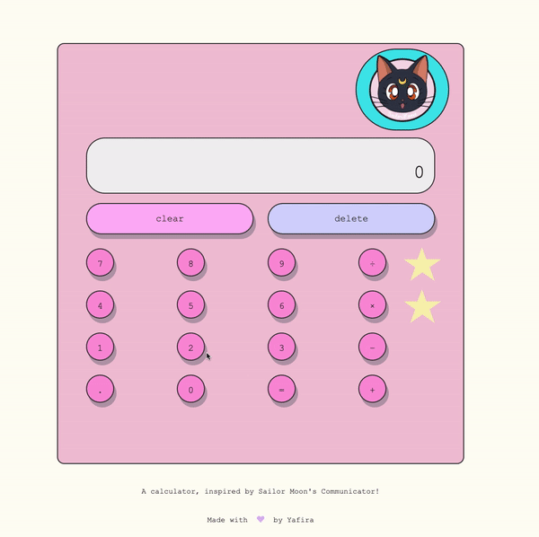

## Calculator

### Built an on-screen calculator using <b>HTML</b>, <b>CSS</b> and <b>JavaScript</b>

- It contains functions for all of the basic math operators you typically find on simple calculators.
- Calculator does not evaluate more than a single pair of numbers at a time but strings together several operations and still can get the right answer, with each pair of numbers being evaluated at a time. If you enter a number then an operator and another number that calculation should be displayed if your next input is an operator.

- And finally, the style is inspired by Sailor Moon's Communicator!

-------------------
--> <a href="https://sailor-moon-calculator.glitch.me/">Live Demo</a>
