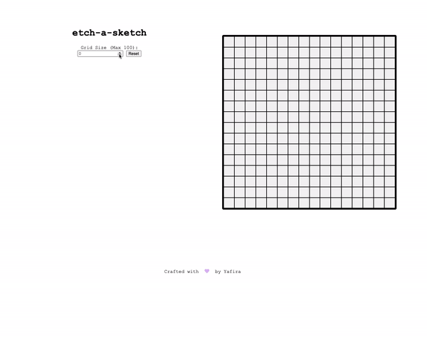

# Etch-A-Sketch

## Objective:
Build a browser version of something between a sketchpad and an Etch-A-Sketch to practice DOM manipulations skills.

1. Create a webpage with a 16x16 grid of square divs. (It’s best to put your grid squares inside another “container” div (which can go directly in your html)).
** There are several different ways to make the divs appear as a grid (versus just one on each line). Feel free to use any or play with each of them:
    - float/clear
    - inline-block
    - flexbox
    - CSS Grid

2. Set up a “hover” effect so that the grid divs change color when your mouse passes over them, leaving a (pixelated) trail through your grid like a pen would.
** Hint: “Hovering” is what happens when your mouse enters a div and ends when your mouse leaves it. You can set up event listeners for either of those events as a starting point.
There are multiple ways to change the color of the divs, including:
    - adding a new class to the div
    - changing the div’s background color using JavaScript.

3. Add a button to the top of the screen which will clear the current grid and send the user a popup asking for the number of squares per side for the new grid. Once entered, the new grid should be generated in the same total space as before (e.g. 960px wide) so that you’ve got a new sketch pad.
** Tip: Set the limit for the user input to a maximum of 100. A larger number of squares results in more computer resources being used, potentially causing delays, freezing, or crashing that we want to prevent.
    - Research button tags in HTML and how you can make a JavaScript function run when one is clicked.
    - Also check out prompts.
    - You should be able to enter 64 and have a brand new 64x64 grid pop up without changing the total amount of pixels used.

(Optional): Instead of just changing the color of a square from black to white (for example), have each pass through with the mouse change it to a completely random RGB value. Then try having each pass just add another 10% of black to it so that only after 10 passes is the square completely black.

## My simple Etch-a-Sketch

* Will revisit this project and complete the optional